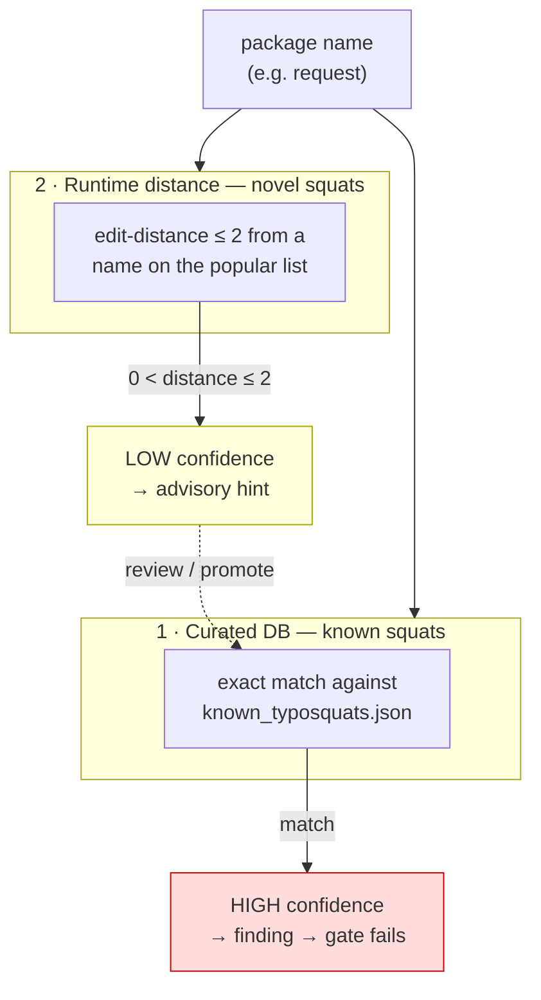

# How detection works

SecureVibe detects threats in two fundamentally different ways, and it is worth
being precise about which is which — because only one of them can catch
something *novel*.

| Layer | Mechanism | Catches | Database-bound? |
|-------|-----------|---------|-----------------|
| **Deterministic scanners** | exact lookups, regex, edit-distance, version-range eval | **known** threats (and close misspellings of known-popular names) | yes |
| **Generation-time skills** | an AI assistant reasons over your code using `SKILL.md` rules | **novel** code flaws with no CVE (SSRF, broken authz, …) | no — pattern reasoning |

Everything on this page about typosquats, malicious packages, secrets, and CVEs
is the **deterministic** layer: fast, cheap, no false drama, but bounded by its
data. The skill layer is covered in [What makes SecureVibe different](features.md);
it is the only layer that is not database-bound.

---

## Typosquat detection

A **typosquat** is a malicious package deliberately named one or two letters off
a popular one — `request` instead of `requests`, `crossenv` instead of
`cross-env` — hoping you fat-finger the name and install the attacker's package.

SecureVibe checks every dependency name two independent ways, kept deliberately
separate by confidence level.



### 1. Curated DB — the "known-bad list"

`vulnerabilities/supply-chain/typosquat-db/known_typosquats.json` is a
human-reviewed list. Each row maps a known squat to the legitimate target it
imitates:

```json
{ "target": "requests", "typosquat": "request", "ecosystem": "pypi",
  "levenshtein_distance": 1, "status": "removed", "discovered": "2017-09-12",
  "references": ["https://…advisory…"] }
```

Detection is a plain **case-insensitive exact match** of the package name
against the `target` or `typosquat` field. Because a human vetted the row, the
match is structural — **`confidence: high`**. In a lockfile scan only the *squat*
side is reported as a finding: depending on the real `requests` is not a
vulnerability.

> **Honest limit.** This catches only squats someone has already filed. The
> stored `levenshtein_distance` is display metadata — the match itself is string
> equality, not a computation.

### 2. Runtime edit-distance — the "looks like a popular name" net

This is the part that catches squats **nobody has filed yet**. For each
dependency, SecureVibe computes the
[Levenshtein distance](https://en.wikipedia.org/wiki/Levenshtein_distance)
(the number of single-character inserts/deletes/substitutions) between the name
and every entry on the per-ecosystem **popular-packages** list
(`vulnerabilities/supply-chain/popular-packages/<eco>.json`).

```
   requests   ← real, popular package (on the popular list)
   request    ← what you typed
   ^^^^^^^
   1 letter missing  →  edit distance = 1  →  suspicious (0 < d ≤ 2)
```

A name within distance 1 or 2 of a popular package — but not equal to it — is
surfaced as a **`confidence: low`** suggestion. Three guards keep it quiet:

- **Explicit ecosystem required** — otherwise an npm name that resembles a PyPI
  one produces cross-language noise.
- **Name normalization** (`typosquatCompareKey`) — lower-cased; for **Go**,
  stripped to the final import-path segment (`bolt` in
  `github.com/boltdb/bolt`) so legitimate forks under other owners don't trip it.
- **Self-popular skip** — if the name is *itself* on the popular list, the sweep
  is skipped. Popular names sit within distance 2 of each other (`chalk`,
  `react`, `lodash`), so without this every popular dependency would false-alarm.

> **Honest limit.** Bounded three ways: the target must be on the popular list,
> the distance must be ≤ 2, and only *names* are compared — there is no
> behavioural analysis.

### The two mechanisms are complementary, not redundant

Three real entries from the shipped database show why both are needed:

| Input | Curated DB | Runtime distance | Caught by |
|-------|-----------|------------------|-----------|
| `crossenv` → `cross-env` (npm) | hit, d=1 | also d=1 | **both** |
| `crossen` (novel, not yet filed) | miss | d=2 from `cross-env` | **runtime net only** |
| `boltdb-go/bolt` → `boltdb/bolt` (Go) | hit, d=3 (full path) | segment `bolt`==`bolt` → d=0, invisible | **curated DB only** |

The last row is the key insight: the attack lives in the **owner** segment
(`boltdb` → `boltdb-go`), which the Go normalization discards to avoid
flagging forks. The runtime net is blind to it; only the curated DB — fed by
human review and upstream feeds — covers that class. Conversely, `crossen` has
never been filed, so only the runtime net sees it.

---

## The other deterministic detectors

Typosquats are one of several deterministic passes the scanner and the CI
[`gate`](../reference/cli.md) run. All share the same confidence bands
(`confirmed` › `high` › `medium` › `low`).

| Detector | How it matches | Confidence |
|----------|----------------|-----------|
| **Malicious packages** | exact name (+ version) against `malicious-packages/<eco>.json` (sourced from OpenSSF) | `confirmed` / `high` |
| **OSV advisories** | resolved version evaluated against each advisory's `affected[].ranges` | `confirmed` (in range) / `high` (version unconfirmed) |
| **CVE patterns** | substring match against curated CVE name/description | `medium` (suggestive) |
| **Secrets** | regex token shapes + Shannon entropy + hotword proximity (`secret_detection.yaml`) | per-rule |
| **Dockerfile / GitHub Actions** | regex + structured (AST) passes for hardening anti-patterns | per-rule |

None of these trace data-flow — a server-side request forgery or a broken
authorization check has no signature to match. Those are the job of the
generation-time **skills**, which encode a *generalizable* pattern ("never fetch
a client-supplied URL without an allowlist") so the assistant recognizes an
instance that has no CVE.

---

## Expanding the databases

Detection coverage grows three ways. After editing any data file, run
`skills-check validate` and `skills-check manifest compute --path . --write`;
releases are then Ed25519-signed out-of-band (see
[SIGNING.md](https://github.com/shieldnet-360/securevibe/blob/main/SIGNING.md)).

### Automated bulk ingestion (maintainer refresh)

```bash
python3 scripts/ingest-malicious-packages.py     # refresh malicious-packages DB (OpenSSF)
python3 scripts/derive-typosquats-from-ossf.py    # derive typosquat rows by name-similarity
python3 scripts/ingest-osv.py                      # refresh OSV cache  (or: skills-check fetch-vulns)
```

`derive-typosquats-from-ossf.py` measures every malicious name against the
popular list and keeps a pair only when **distance ∈ {1, 2}** *and* the length
difference is ≤ 2. Each derived row carries `source: ossf-malicious-packages-derived`
plus the upstream `osv_id`; hand-curated rows are preserved untouched.

### Manual curation (a PR)

Add a row to `known_typosquats.json` or `malicious-packages/<eco>.json`. Every
entry **requires at least one external reference** — CI rejects anonymous
"trust me" entries.

!!! tip "Highest-leverage move: grow the popular-packages list"
    The runtime net's coverage is *popular list × distance ≤ 2*. Adding a
    moderately-popular package to `popular-packages/<eco>.json` instantly makes
    every distance-1/2 misspelling of it detectable — and feeds the
    derive script, which anchors on this list. Widening the popular list widens
    the zero-day net for free.

### Contribute-back (field → upstream)

```bash
skills-check contribute add -p request -e pypi --reason "typosquat of requests"  # instant local block
skills-check contribute keygen
skills-check contribute submit --key ed25519.key                                 # signed candidate → PR
```

A maintainer runs `contribute verify`, promotes the candidate into the curated
DB, and it ships in the next signed release that every `skills-check update`
pulls. See [Contribute a Finding](../contribute.md).

---

## One-line summary

> Typosquat detection is database-bound on purpose: the **curated DB** gives a
> build-failing verdict on known squats, while the **edit-distance net** against
> *popular* names catches novel ones before any human files them. Neither alone
> is enough, so both run — and the only layer that is *not* database-bound is
> the generation-time skill that catches code flaws with no signature at all.
